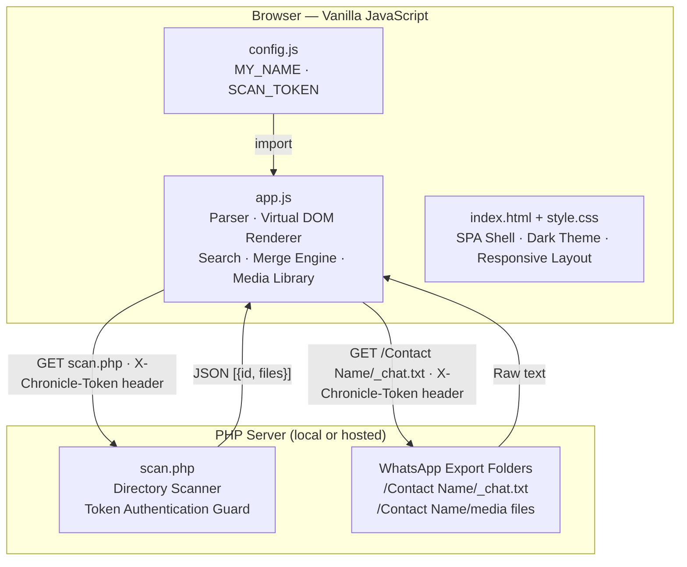

# WhatsApp Archive Viewer


A fully local, zero-dependency WhatsApp archive viewer. Parses `_chat.txt` export files and renders them as a searchable, dark-mode chat interface. Handles archives of any size, including chats exceeding 500,000 messages, with no uploads, no third-party APIs, and no build toolchain.

All data processing happens in the browser. Nothing leaves the machine.

---

## What It Does

WhatsApp's "Export Chat" feature produces a folder containing `_chat.txt` (the full message transcript) and any attached media files. Most text editors render this as an unreadable wall of timestamps and metadata. This application renders the same folder as a faithful, fully navigable WhatsApp-style chat interface.

**Core capabilities:**

- **Offline, local-first.** No server-side message processing. Place the application files alongside the export folders, start a local PHP server for directory scanning, and everything runs in the browser.
- **Handles any archive size.** A virtual DOM windowing system keeps at most 200 message nodes in the DOM at any time. Chats with 500,000 messages open in under two seconds.
- **Multi-chat support.** The sidebar auto-discovers all export folders in the directory, sorted by last-message timestamp. Switch between chats without a page reload.
- **Chat merge engine.** Exporting the same chat multiple times produces sibling folders with suffix patterns (`Alice`, `Alice_01`, `Alice_02`). This arises naturally when a chat is exported, the history is cleared, and further exports are made months or years later. A per-chat toggle merges all sibling folders into one chronological, deduplicated stream, reconstructing the full history across all exports.
- **Full-text search.** Searches the entire message history and renders up to 250 matches. Each result jumps directly to the target message with an animated highlight.
- **Media library.** A tab-based drawer (Images / Videos / Files) aggregates all media from the active chat. Videos include an inline 5-second preview. All files are available for download.
- **Token authentication.** The PHP directory scanner requires a matching `X-Chronicle-Token` header on every request. Unauthenticated access returns HTTP 403.
- **Zero dependencies.** No npm, no build step, no framework. One HTML file, one CSS file, one JavaScript module, one PHP script.

---

## Architecture



At boot, `initApp()` fetches `scan.php`, receives the list of valid chat folders, and issues parallel `fetch()` calls to read each `_chat.txt`. Only the last-message statistics (`timestamp`, `lastMsg`, `lastDate`) are retained from each file at this stage and stored in `globalFolderStats{}` for sidebar rendering. Full message parsing is deferred to when a user selects a chat and cached in `allChats{}` thereafter.

Full architecture reference: [docs/ARCHITECTURE.md](docs/ARCHITECTURE.md)

---

## Requirements

| Component | Minimum |
|---|---|
| PHP | 8.0 |
| Browser | Chrome 90+, Firefox 90+, Safari 15+, Edge 90+ |
| WhatsApp Export | Any platform (iOS or Android export format) |

No other dependencies.

---

## Quick Start

**1. Clone the repository.**

```bash
git clone https://github.com/nshah1d/whatsapp-archive-viewer.git
cd whatsapp-archive-viewer
```

**2. Add WhatsApp exports.**

Place each exported chat folder directly inside the project root. Each folder must contain a file named exactly `_chat.txt`.

```
whatsapp-archive-viewer/
├── app.js
├── config.js
├── index.html
├── scan.php
├── style.css
│
├── Alice Export/          ← WhatsApp export folder
│   ├── _chat.txt          ← required filename, exact spelling
│   ├── IMG-20231225-WA0001.jpg
│   └── VID-20231226-WA0002.mp4
│
└── Family Group/
    ├── _chat.txt
    └── DOC-20240101-WA0003.pdf
```

**3. Generate a token.**

The token is a shared secret between `config.js` and `scan.php`. Any random hex string of at least 32 characters is appropriate.

```bash
# Linux / macOS
openssl rand -hex 16

# Windows (PowerShell)
[System.BitConverter]::ToString(
  [System.Security.Cryptography.RandomNumberGenerator]::GetBytes(16)
).Replace("-","").ToLower()
```

**4. Configure the application.**

Open `config.js` and set both fields:

```javascript
export const MY_NAME = "Your Name";
export const SCAN_TOKEN = 'your-generated-token';
```

`MY_NAME` must match the name that appears in `_chat.txt` for outgoing messages. Open `scan.php` and set the matching constant on line 2:

```php
define('EXPECTED_TOKEN', 'your-generated-token');
```

Both values must be identical.

**5. Start the PHP server.**

```bash
php -S localhost:8000
```

**6. Open the application.**

Navigate to `http://localhost:8000` in any modern browser.

---

## Directory Layout

```
whatsapp-archive-viewer/
│
├── app.js          # All client-side logic: parser, renderer, virtual DOM,
│                   # search, merge engine, media library
├── config.js       # User configuration: MY_NAME, SCAN_TOKEN
├── index.html      # SPA shell: three-panel layout, SEO metadata
├── scan.php        # PHP backend: directory scanner, token authentication
├── style.css       # Dark theme CSS, responsive layout
├── robots.txt      # Disallows all crawling of hosted instances
│
├── docs/
│   ├── ARCHITECTURE.md   # Technical reference: parser, virtual DOM, merge engine
│   └── CONFIGURATION.md  # Full configuration and deployment reference
│
└── LICENSE
```

---

## Export Format

WhatsApp exports differ slightly between iOS and Android, but both produce a `_chat.txt` with lines in this format:

```
[DD/MM/YYYY, HH:MM:SS] Contact Name: Message text
[DD/MM/YYYY, HH:MM:SS] Contact Name: <attached: filename.jpg>
```

The parser uses a single regular expression (see `app.js`, line 3):

```javascript
const DATE_REGEX = /\[(\d{1,2}\/\d{1,2}\/\d{2,4}),\s*(\d{1,2}:\d{1,2}(?::\d{1,2})?)\]\s*(.*?):\s*(.*)/;
```

This covers two-digit and four-digit years, optional seconds in the timestamp, and both date orderings produced by different regional WhatsApp settings.

---

## Configuration

Full configuration reference: [docs/CONFIGURATION.md](docs/CONFIGURATION.md)

| Variable | File | Description |
|---|---|---|
| `MY_NAME` | `config.js` | Name as it appears in `_chat.txt` for outgoing messages. Must be an exact match. |
| `SCAN_TOKEN` | `config.js` | Shared authentication token sent as the `X-Chronicle-Token` request header. |
| `EXPECTED_TOKEN` | `scan.php` | Server-side constant. Must be identical to `SCAN_TOKEN`. |

Both `config.js` and `scan.php` ship with empty token values. Set both to the same non-empty string before use.

---

## Deployment

For local use, the PHP built-in server (`php -S localhost:8000`) is sufficient.

For a hosted deployment on any PHP-enabled web server:

1. Upload `app.js`, `config.js`, `index.html`, `robots.txt`, `scan.php`, and `style.css` to a directory on the server.
2. Upload the WhatsApp export folders to the same directory.
3. Ensure `scan.php` has read access to the directory.
4. Set `EXPECTED_TOKEN` in `scan.php` and `SCAN_TOKEN` in `config.js` to matching, non-empty values.
5. Access the directory via HTTPS.

`robots.txt` ships with `Disallow: /` to prevent search engines from indexing the hosted instance and its chat data. Do not remove it from a public-facing deployment.

Full deployment reference: [docs/CONFIGURATION.md](docs/CONFIGURATION.md)

---

## Security

Full security reference: [SECURITY.md](SECURITY.md)

The application follows a privacy-first model:

- All message parsing and rendering is client-side. `scan.php` never reads message content; it only returns folder names and file inventories.
- Every request to `scan.php` and every `_chat.txt` fetch requires a valid `X-Chronicle-Token` header. Mismatched or absent tokens receive HTTP 403.
- `robots.txt` disables crawling and indexing of the hosted instance by default.
- No analytics, no telemetry, no external scripts of any kind.

---

<div align="center">
<br>

**_Architected by Nauman Shahid_**

<br>

[](https://www.nauman.cc)
[](https://github.com/nshah1d)
[](https://www.linkedin.com/in/nshah1d/)

</div>
<br>

Licensed under the [MIT Licence](LICENSE).
