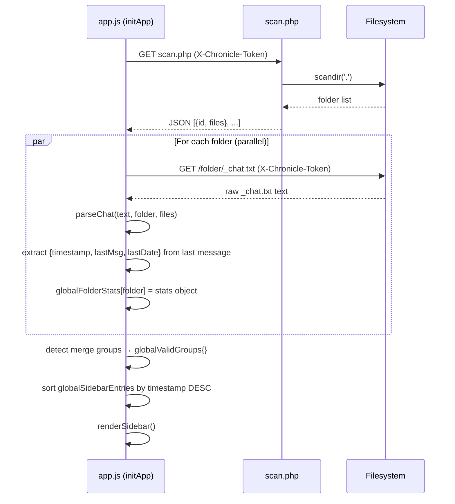

# Architecture Reference

This document provides a technical reference for the WhatsApp Archive Viewer codebase. It covers the parser design, the virtual DOM windowing system, the boot sequence, the global state model, the chat merge engine, and the full-text search implementation.

---

## System Overview

```mermaid
flowchart LR
    subgraph Boot ["Boot Sequence"]
        A["initApp()"] -->|"fetch scan.php"| B["scan.php returns [{id, files}]"]
        B -->|"parallel fetch _chat.txt per folder"| C["parseChat()"]
        C -->|"extract last message stats only"| D["globalFolderStats{}"]
        D --> E["renderSidebar()"]
    end

    subgraph OnSelect ["On Chat Selection"]
        F["loadChat() / loadMergedChat()"] -->|"fetch + parseChat() if not cached"| G["allChats{}"]
        G --> H["renderMessageChunk()"]
        H --> I["DOM Window (max 200 nodes)"]
    end

    E -->|"user clicks chat"| F
```



The application has two distinct data phases. The boot phase populates only the sidebar. The selection phase parses the full message array and renders the virtual DOM window.

---

## The Parser: Interpreting `_chat.txt`

The entire message parsing logic is contained in `parseChat()` in `app.js`. WhatsApp's export format is line-delimited plain text. Each message occupies one or more lines beginning with a timestamp bracket.

The primary pattern (line 3 of `app.js`):

```javascript
const DATE_REGEX = /\[(\d{1,2}\/\d{1,2}\/\d{2,4}),\s*(\d{1,2}:\d{1,2}(?::\d{1,2})?)\]\s*(.*?):\s*(.*)/;
```

Group captures:
- Group 1: date string (`DD/MM/YYYY` or `DD/MM/YY`)
- Group 2: time string (with or without seconds)
- Group 3: sender name (everything before the first `: ` after the timestamp)
- Group 4: message text (everything after the first `: `)

Multi-line messages are handled by appending continuation lines to the previous message's text until a new timestamp pattern is matched.

Media attachments are detected via a second pattern (line 4 of `app.js`):

```javascript
const ATTACHMENT_REGEX = /<attached: (.*?)>/;
```

When this pattern matches within a message's text, the filename is extracted and cross-referenced against the folder's file inventory (supplied by `scan.php`) to determine whether the attachment is present or missing.

Each parsed message object has this schema:

```javascript
{
    date: "15/11/2023",
    time: "14:32:05",
    sender: "Alice",
    text: "See you tomorrow",
    filename: null,       // populated for media messages
    ext: null,            // file extension
    path: null,           // relative path for fetch
    isMissing: false,     // true if file not in inventory
    originalIndex: 1042   // position in the full messages array
}
```

`originalIndex` is critical: it links DOM elements back to their position in the messages array, enabling the `jumpToMessage()` function to locate any message regardless of the current virtual window position.

---

## Virtual DOM Windowing

WhatsApp archives frequently exceed tens of thousands of messages. Rendering all of them simultaneously as DOM nodes causes memory exhaustion and layout freezes. The windowing system bounds the live DOM node count to `MAX_DOM_MSGS` (default: 200) regardless of total archive size.

Three constants govern the performance budget (lines 5-7 of `app.js`):

```javascript
const MSG_CHUNK_SIZE = 50;   // messages added per scroll trigger
const MEDIA_CHUNK_SIZE = 30; // media items added per scroll trigger
const MAX_DOM_MSGS = 200;    // maximum live message nodes in the DOM
```

The current window position is tracked in `renderState`:

```javascript
let renderState = {
    msgStartIndex: 0,    // index of first message currently in the DOM
    msgEndIndex: 0,      // index of last message currently in the DOM
    mediaIndex: 0,       // pagination cursor for the media drawer
    isSearching: false,  // blocks scroll-triggered loads during search
    isHistoryView: false // flags a jump-to-message navigation state
};
```

`msgStartIndex` and `msgEndIndex` always describe a valid slice of `allChats[currentChatID].messages`. The DOM always reflects exactly that slice. When the user scrolls to the top edge, `handleMessageScroll()` prepends the previous chunk and calls `pruneDOM('bottom')` to remove an equivalent number of nodes from the bottom edge, and vice versa.

### Scroll Compensation on Prepend

Prepending content to a scrollable container shifts all existing content downward visually. Without compensation, the viewport would appear to jump. `renderMessageChunk()` compensates by recording `scrollHeight` before insertion and restoring the scroll offset afterwards:

```javascript
const oldScrollHeight = container.scrollHeight;
container.insertAdjacentHTML('afterbegin', html);
const newScrollHeight = container.scrollHeight;
container.scrollTop = newScrollHeight - oldScrollHeight;
```

### DOM Pruning and Index Tracking

`pruneDOM()` removes nodes from the opposite edge of the window after each chunk load. The container holds three node types: `.msg` (message bubbles), `.date-divider` (date separators), and `.source-boundary` (merge indicators). Only `.msg` nodes correspond to positions in the messages array. The index update therefore counts only nodes of class `.msg`:

```javascript
let msgCount = 0;
for (let i = 0; i < toRemove; i++) {
    if (children[i]) {
        removedHeight += children[i].offsetHeight;
        if (children[i].classList.contains('msg')) msgCount++;
        children[i].remove();
    }
}
container.scrollTop = Math.max(0, container.scrollTop - removedHeight);
renderState.msgStartIndex += msgCount;
```

Using the total `toRemove` count instead of `msgCount` would accumulate index error on every prune cycle, eventually causing jump-to-message navigation to target incorrect positions.

---

## Boot Sequence: `initApp()`



`initApp()` calls `parseChat()` for every folder at boot purely to extract sidebar statistics. The full `messages` and `media` arrays returned by `parseChat()` are discarded. Only `globalFolderStats{}` is retained.

`allChats{}` remains empty at boot. It is populated on the first time a user opens each individual chat via `loadChat()` or `loadMergedChat()`, then cached for subsequent visits.

---

## Global State Model

| Object | Populated | Contents |
|---|---|---|
| `globalFolderStats{}` | Boot (`initApp`) | `{id, timestamp, lastMsg, lastDate}` per folder. Sidebar data only. |
| `globalValidGroups{}` | Boot (`initApp`) | Merge group definitions: `{ baseName: [{id, files}, ...] }`. |
| `globalChatFolders[]` | Boot (`initApp`) | Raw `scan.php` response. |
| `globalSidebarEntries[]` | Boot (`initApp`) | Sorted sidebar entries (merged groups + standalone chats). |
| `allChats{}` | On first selection | Full `{messages, media}` per chat. Persists across the session. |
| `currentChatID` | On selection | The active chat's key in `allChats{}`. |

`allChats{}` is the single source of truth for message and media data. Its key is either the folder name (for standalone chats) or the merge group's base name (for merged chats).

---

## The Chat Merge Engine

### Detection (in `initApp()`)

Exporting the same chat multiple times produces sibling export folders. This occurs naturally: a chat is exported in 2024, the history is cleared, and a second export is made in 2025. Both exports share the same contact name but receive suffix variants to avoid overwriting the previous folder on the filesystem (`Alice_01`, `Alice_02`, or `Alice(1)`, `Alice(2)`).

The merge engine supports two suffix patterns:

| Pattern | Example folders |
|---|---|
| Underscore-numbered | `Alice`, `Alice_01`, `Alice_02` |
| Parentheses-numbered | `Alice`, `Alice(1)`, `Alice(2)` |

The detection algorithm:
1. Groups all folders by their base name (the name stripped of any suffix).
2. For each group with two or more members, verifies that the numbered suffixes form a gapless sequence starting from 1 (or that a single unsuffixed base folder exists).
3. Groups that pass validation are stored in `globalValidGroups{}` as merge candidates. All others are treated as standalone chats.

The base folder (no suffix) is optional. A pair such as `Alice_01` + `Alice_02` forms a valid group without a plain `Alice` folder.

### Merging (in `loadMergedChat()`)

When a user opens a merge group:
1. `_chat.txt` is fetched from each sibling folder in sequence.
2. Each file is parsed by `parseChat()` and every message is tagged with `sourceFolder`.
3. All message arrays are concatenated and sorted globally by `parseDateString(date, time)`, with the full message text as an alphabetical tiebreak for messages with identical timestamps.
4. A forward-pass deduplication step removes messages where all four fields (`date`, `time`, `sender`, `text`) are identical to the previous message. This removes the exact duplicates that appear at the boundary between sibling exports.
5. The merged array is written to `allChats[baseName]` and cached.

Source-boundary dividers are inserted into the DOM between messages from different source folders, providing a visual indicator of where one export ends and the next begins.

---

## Full-Text Search

`handleSearch()` filters `allChats[currentChatID].messages` against the user's query:

```javascript
const escapedQ = query.replace(/[.*+?^${}()|[\]\\]/g, '\\$&');
const re = new RegExp(escapedQ, 'gi');
```

The query is escaped before constructing the `RegExp` to prevent crashes from metacharacter input. Matches are rendered as standalone DOM cards with the matched substring highlighted via the same `RegExp`. Results are capped at 250 with a user-facing notice when the cap is reached.

Each result card calls `window.jumpToMessage(index)` on click, which centred the target message's `originalIndex` within a new `MSG_CHUNK_SIZE` window and scrolls it into view with a `flash-highlight` animation.

---

## Media Library

The media drawer is populated by `renderMediaDrawer()`, which reads `allChats[currentChatID].media`. The media object is structured at parse time:

```javascript
media: {
    images: [ {path, filename, ext, isMissing} ],
    videos: [ {path, filename, ext, isMissing} ],
    docs:   [ {path, filename, ext, isMissing} ]
}
```

Items are rendered in batches of `MEDIA_CHUNK_SIZE` (default: 30). An `IntersectionObserver` on a sentinel element at the bottom of the drawer triggers the next batch load as the user scrolls.

Video items include a 5-second preview that plays on hover (desktop) or tap (mobile). A singleton pattern ensures only one video plays at any time: the `HTMLVideoElement.play()` call on a new item pauses the previously active player before starting.

A context menu (right-click on desktop, long-press on mobile) provides Full Screen and Download actions. Menu position is clamped to the viewport boundaries using `getBoundingClientRect()` to prevent overflow on small screens.

---

<div align="center">
<br>

**_Architected by Nauman Shahid_**

<br>

[](https://www.nauman.cc)
[](https://github.com/nshah1d)
[](https://www.linkedin.com/in/nshah1d/)

</div>
<br>

Licensed under the [MIT Licence](LICENSE).
